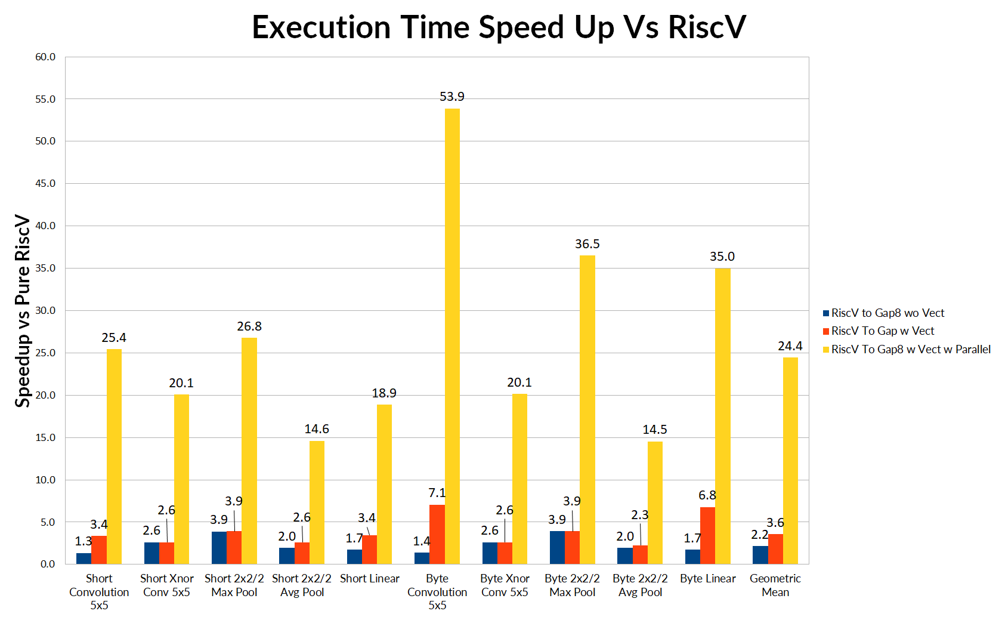
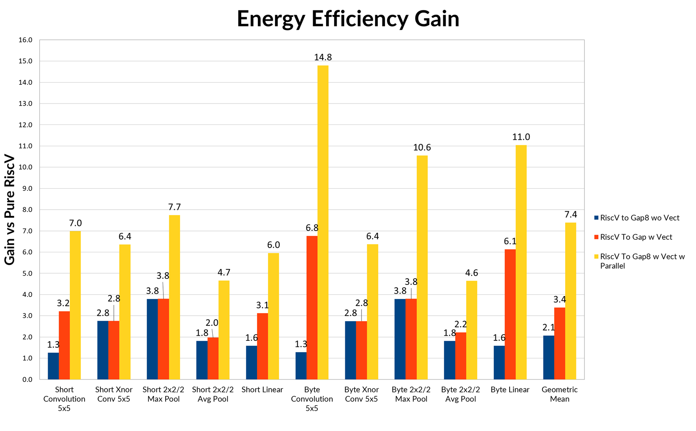
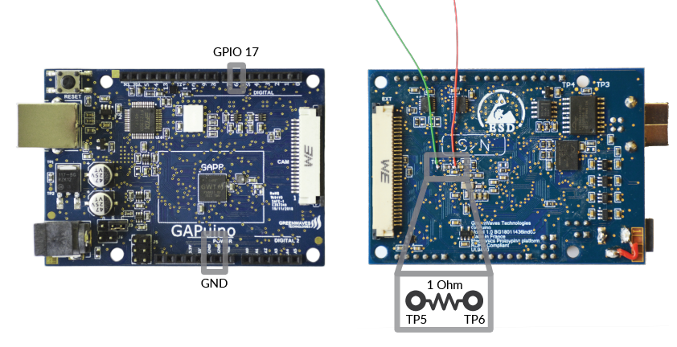

# GAP8 CNN Benchmarks

We developed a test suite to test the gap8 cluster cores computational power and energy efficiency on a representative subset of Convolution Neural Networks (CNN) Layers. This guide gives the ability to the user to run by himself all the benchmarks and check cycles and energy results.

###Benchmarks Description

Here the list of benchmarks of this test suite:

- 2x2 stride 2 Max Pooling Layer
- 2x2 stride 2 Average Pooling Layer
- 5x5 stride 1 Convolutional Layer
- 5x5 stride 1 Xnor Convolutional Layer
- Linear (Fully Connected) Layer

The benchmarks can be executed in 2 modalities:

1. Pure RiscV Standard ISA
2. Gap8 ISA (RiscV Std ISA + Gap8 ISA extensions \*)
    - Single Core
    - Single Core with Vectorization (Byte or Short)
    - Parallel (8 Cores) with Vectorization (Byte or Short)

\* A list of all ISA extensions of Gap8 can be found in section "Device components description" of [Gap8 Reference Manual](https://greenwaves-technologies.com/sdk-manuals/)

###Benchmarks Results

Here we reported the speedup we obtain in terms of cycles. The baseline is the Pure RiscV ISA.

### How to run the Benchmarks

To run the benchmarks with RiscV Std ISA + Gap8 ISA extensions you can just type:

~~~sh
$ make clean all run
~~~

This will be the output that you get:

~~~sh
OUTPUT TO BE ADDED
~~~

##### To run the benchmarks in RiscV Standard ISA mode (only single core)

~~~sh
make clean all RISCV_FLAGS="-march=rv32imc -DRISCV"
~~~

##### Change Benchmarks Parameters

To switch input data between Byte and Short a define has been placed at beginning of AllTest.c file. Comment it out to test it with shorts.

~~~sh
#define BYTE
~~~

To change the number of iterations executed for each benchmark the iteration number can be changed from this define:

~~~sh
#define ITERATIONS 1
~~~

To change Fabric Controller and Cluster Frequencies you can use this defines. Both of then can be alimented at 1 or 1.2 Volts.

~~~c
#define ALIM_1_VOLT 1
#define FREQ_FC (50 * 1000000)
#define FREQ_CL (50 * 1000000)
~~~

Here is a table of the supported max frequencies:

| Input Voltage |  FC Max Freq    | CL Max Freq   |
|    ---        |---              |    ---        |
| 1.0 V         |  150            |      90       |
| 1.2 V         |  250            |     175       |

### How to measure the Power Consumption on the Gapuino Board

The energy consumed by each benchmark can be measured using a differential probes oscilloscope. The differential probe is connected to the tests point 5 and 6 (TP5 and TP6). A 1 Ohm resistor is already placed between the two test points on the board. Before each kernel is launched the benchmark asserts the GPIO 17 and once each single benchmark is finished de-asserts it. So this GPIO can be used as trigger for the energy measurements. In the following figure a description of the physical pins on Gapuino board:

To enable the GPIO PIN this define should be commented out:

~~~c
#define NOGPIO
~~~

The results presented in the previous section are sampled with a PicoScope 4444 using 1 probe connected to GPIO 17 and 1 differential probe to measure the Voltage Drop. The voltage drop can be directly converted to current thanks to the 1 Ohm resistor (I = V / R, where R is 1).

Here an example of the output screen of some measurements conducted with the PicoScope and how to interpret them.
