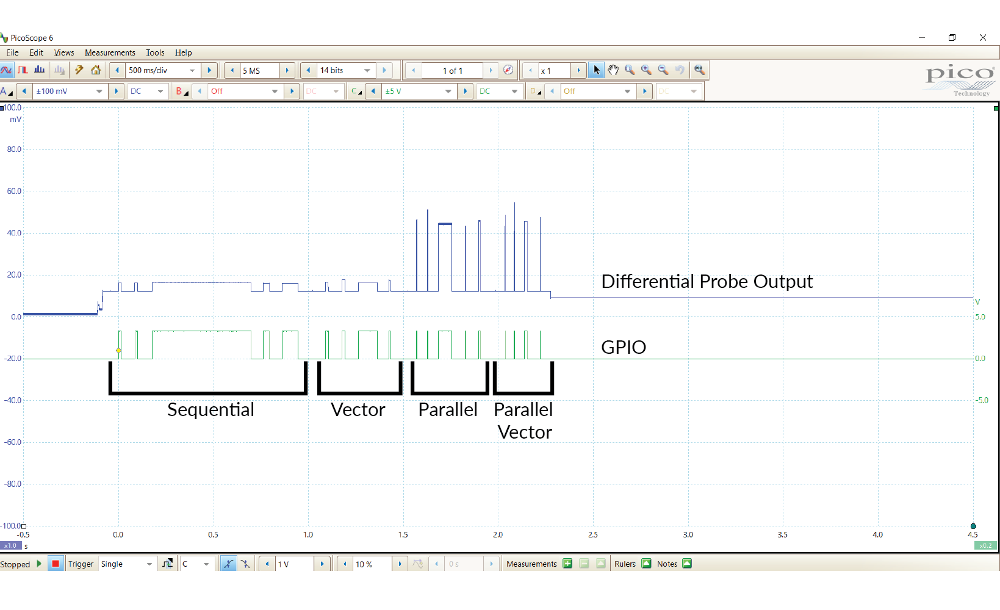

# GAP8 CNN Benchmarks

We developed a test suite to test the gap8 cluster cores performance and energy efficiency on a representative subset of Convolution Neural Networks (CNN) Layers. This guide gives the ability to the user to run by himself the benchmarks and check cycles and energy results.

### Benchmarks Description

Here the list of benchmarks of this test suite:

- 2x2 stride 2 Max Pooling Layer
- 2x2 stride 2 Average Pooling Layer
- 5x5 stride 1 Convolutional Layer
- 5x5 stride 1 Xnor Convolutional Layer
- Linear (Fully Connected) Layer

The benchmarks can be executed in 2 modalities:

1. Pure RiscV Standard ISA
2. Gap8 ISA (RiscV Std ISA + Gap8 ISA extensions \*)
    - Single Core
    - Single Core with Vectorization (Byte or Short)
    - Parallel (8 Cores) with Vectorization (Byte or Short)

Each Gap8 Cluster core embeds a vector unit capable of 4 byte operations or 2 short operations per cycle*.

\* A list of all ISA extensions of Gap8 can be found in section "Device components description" of [Gap8 Reference Manual](https://greenwaves-technologies.com/sdk-manuals/)

### Benchmarks Results

Here we reported the performance and energy results measured on the Gapuino Board. In the next sections we explains how to reproduce these results with your Gapuino Board.

In the following chart we show the execution time speed up of Gap8. The baseline is the Pure RiscV ISA. All the experiment were conducted on a Gapuino Baord.

As we can see Gap8 Benefits of all the 3 optimization steps. The speed up of Gap8 ISA extensions, vectorization and parallelization is between 14.5x and 53.9x. Which means that for instance at max Gap8 frequency **for a 5x5 byte convolutional layer on a 112x112 grayscale input image with 100 output filters, on Gap8 it takes only 12.8 ms while on a single core standard RiscV ISA 729.4 ms**.

The next analysis shows the energy efficiency gain in relation with RiscV Standard ISA.

Here the results shows that

### How to run the Benchmarks

To run the benchmarks with RiscV Std ISA + Gap8 ISA extensions you can just type:

~~~sh
$ make clean all run
~~~

This will be the output that you get:

~~~sh

                      --------------------------------------------------------
                      --------------------------------------------------------
                      ---------------   GAP8 benchmarks   --------------------
                      --------------------------------------------------------
                      --------------------------------------------------------

Gap8 Input Voltage    : 1.2 Volts
Fabric Controller Freq: 250 MhZ
Cluster  Freq         : 175 MhZ

Number of iterations for each benchmark: 100

                      ---------------        Sequential   ---------------
                2x2/2 Max Pool Input: 112x112 (x100 iterations) Time:      14557 uSec. Cycles:    2573762
                2x2/2 Avg Pool Input: 112x112 (x100 iterations) Time:      14527 uSec. Cycles:    2573659
              5x5 Convolutions Input: 112x112 (x100 iterations) Time:     520813 uSec. Cycles:   92241320
                        Linear Input: 1024x16 (x100 iterations) Time:      32532 uSec. Cycles:    5765099
                 Xnor Conv 5x5 Input: 100x100 (x100 iterations) Time:      80994 uSec. Cycles:   14349428

                      ---------------            Vector   ---------------
                2x2/2 Max Pool Input: 112x112 (x100 iterations) Time:      16174 uSec. Cycles:    2864082
                2x2/2 Avg Pool Input: 112x112 (x100 iterations) Time:      12696 uSec. Cycles:    2249276
              5x5 Convolutions Input: 112x112 (x100 iterations) Time:     100067 uSec. Cycles:   17741015
                        Linear Input: 1024x16 (x100 iterations) Time:       8270 uSec. Cycles:    1465880

                      ---------------          Parallel   ---------------
                2x2/2 Max Pool Input: 112x112 (x100 iterations) Time:       2167 uSec. Cycles:     382837
                2x2/2 Avg Pool Input: 112x112 (x100 iterations) Time:       2136 uSec. Cycles:     380589
              5x5 Convolutions Input: 112x112 (x100 iterations) Time:      72052 uSec. Cycles:   12810568
                        Linear Input: 1024x16 (x100 iterations) Time:       4425 uSec. Cycles:     790475
                 Xnor Conv 5x5 Input: 100x100 (x100 iterations) Time:       9704 uSec. Cycles:    1729797

                      ---------------   Parallel Vector   ---------------
                2x2/2 Max Pool Input: 112x112 (x100 iterations) Time:       2014 uSec. Cycles:     355563
                2x2/2 Avg Pool Input: 112x112 (x100 iterations) Time:       1861 uSec. Cycles:     332328
              5x5 Convolutions Input: 112x112 (x100 iterations) Time:      12848 uSec. Cycles:    2281309
                        Linear Input: 1024x16 (x100 iterations) Time:       1252 uSec. Cycles:     223484

~~~

##### To run the benchmarks in RiscV Standard ISA mode (only single core)

~~~sh
make clean all run RISCV_FLAGS="-march=rv32imc -DRISCV"
~~~

##### Change Benchmarks Parameters

To switch input data between Byte and Short a define has been placed at beginning of AllTest.c file. Comment it out to test it with shorts.

~~~sh
#define BYTE
~~~

To change the number of iterations executed for each benchmark the iteration number can be changed from this define:

~~~sh
#define ITERATIONS 1
~~~

To change Fabric Controller and Cluster Frequencies you can use this defines. Both of then can be alimented at 1 or 1.2 Volts.

~~~c
#define ALIM_1_VOLT 1
#define FREQ_FC (50 * 1000000)
#define FREQ_CL (50 * 1000000)
~~~

Here is a table of the supported max frequencies:

| Input Voltage |  Fabric Controller Max Freq    | Cluster Max Freq   |
|    ---        |---              |    ---        |
| 1.0 V         |  150 MhZ        |      90 MhZ   |
| 1.2 V         |  250 MhZ        |     175 MhZ   |

### How to measure Power Consumption on the Gapuino Board

The energy consumed by each benchmark can be measured using a differential probes oscilloscope. The differential probe is connected to the tests point 5 and 6 (TP5 and TP6). A 1 Ohm resistor is already placed between the two test points on the board. Before each kernel is launched the benchmark asserts the GPIO 17 and once each single benchmark is finished de-asserts it. So this GPIO can be used as trigger for the energy measurements. In the following figure a description of the physical pins on Gapuino board:

To enable the GPIO PIN this define should be commented out:

~~~c
#define NOGPIO
~~~

The results presented in the previous section are sampled with a PicoScope 4444 using 1 probe connected to GPIO 17 and 1 differential probe to measure the voltage drop. The voltage drop can be directly converted to current thanks to the 1 Ohm resistor (I = V / R, where R is 1).

Here an example of Piscope output screen of the benchmarks:

The Gpio gives us the starting and ending point of each benchmark.
